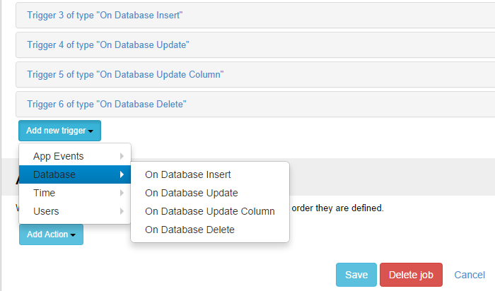

# Database Triggers

The database triggers are automatically executed in response to certain events in a database, when an entry is inserted, updated or deleted from the database. They can be used when there is a need to perform a certain action as a result of an INSERT, UPDATE or DELETE. This opens the doors to unlimited possibilities.

The supported database events are:

* 
On Database Insert: triggers when data is inserted into a table. The job is fired once for every inserted row ; 
* 
On Database Update: triggers when data is updated into a table. The job is fired once for every row that was updated ;
* 
On Database Update Column: triggers when data is updated into a named column. The job is fired once for every row that was updated ;
* 
On Database Delete: triggers when data is deleted from a table. The job is fired once for every deleted row.

Notice that the tokens are built automatically using column names, so you can reference inserted, updated or deleted values inside actions using [ColumnName] token syntax. You also get the original value using the [ColumnName:Before] syntax.

Notes:
* You can not use text/ntext/image sql columns for Database Update Column
* If you use a token for a nullable column keep in mind that the tokenization rezult is actually a empty string (ie nothing). In order to have NULL as tokenization result set first action an *Inject Data* with condition *[ColumnName] == ""* and in Data the element with name *ColumnName* and value *NULL*.