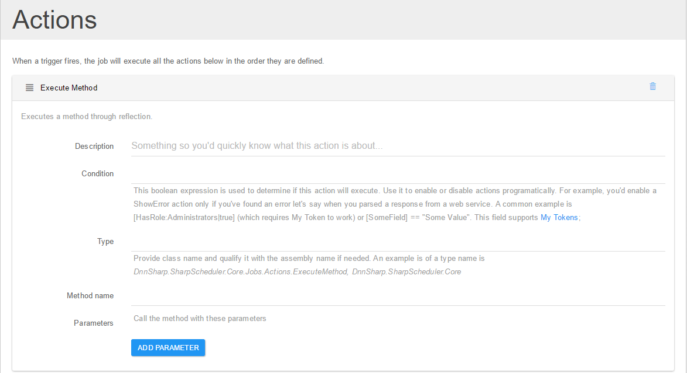

# Execute Method

This action uses reflection to execute a method from an already loaded assembly (for example from the /bin folder or from GAC). This makes it easy to integrate 3rd party code through exposed methods that accept basic parameter types. We’ve made such an integration with Search Boost to allow granular indexing of folders, modules and custom rules. 

Note that this action will try to convert the values you provide in the Parameters field to the respective types that are expected by the method. Currently only basic types are supported, like ints or strings. If the method requires more complex types then you have two options: 

a. If you own the code then create simplified methods. That’s exactly what we did for Search Boost. We’ve added a new set of methods that accept simple parameters like rule name, portal ID or folder path.

b. If you don’t own the code, you can use My Tokens to create a Razor Script, reference the assemblies you need and invoke the methods directly.

The Execute Method action exposes the following configuration options: 

**Type **

This is the type that contains the method. Provide class name and qualify it with the assembly name if needed. An example of a type name is DnnSharp.SharpScheduler.Core.Jobs.Actions.ExecuteMethod, DnnSharp.SharpScheduler.Core. This field is case insensitive and accepts context tokens (for example [ContextTokenName]) and My Tokens. 

**Method Name** 

This is the name of a method that exists in the class specified above. This action can handle both static and non-static methods. In case of non-static methods, the class must have a default constructor. This field is case insensitive and accepts context tokens (for example [ContextTokenName]) and My Tokens. 

**Parameters ** 

This is a list of values to pass to the method. Each parameter is identified by its name (case insensitive), so the order in which you specify them doesn't matter. Sharp Scheduler will try to best convert the values to their respective types, but ultimately it’s your responsibility to ensure that you pass valid input into the methods. Each parameter can contain context tokens (for example [ContextTokenName]) and My Tokens. 

One interesting aspect about the Execute Method action is that all the options can also be provided via the configuration file. This way, we (developers and system integrators) protect end-users from the technical details and also prevent them from breaking configuration. The reflection parameters are provided via the configuration file, while no parameters, such as the rule name, are shown on the front end.

