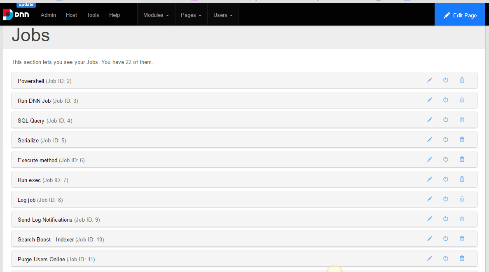

# Getting Started

This page guides you through setting up Sharp Scheduler. Let's say you want to send an e-mail once at a specified date and time.

Before you proceed, make sure you have Sharp Scheduler installed on your portal. You can download it from the Sharp Scheduler [download page](http://www.dnnsharp.com/dnn/modules/sharp-task-scheduler/download) and install it from Host > Extensions.

Create a page and add Sharp Scheduler as you normally would any other module, then locate and click the New Job button in order to create a new job.

Provide a unique name for your job

Locate the Add New Trigger dropdown button and choose the One Time option from the Time category. Notice that there is no limit on how many triggers a job can have.

In this scenario, we want to send an email to a specific email address. In the Actions section, click the Add Action button, then select Email > Send Email.

