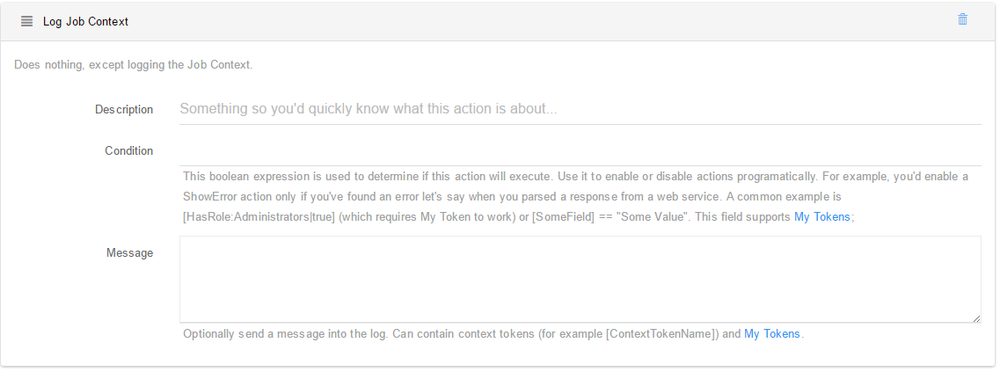
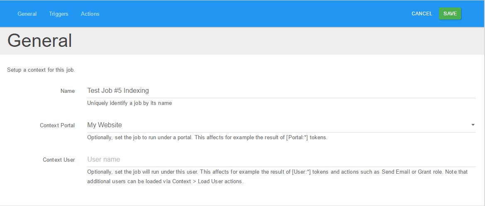

# Log Job Context

Log Job Context is a function that logs the Job Context and could also be used as a debugging function. This function logs variables like tokens, meta dates, provides info about when the job will run again.

One important concept in Sharp Scheduler is context. At a minimum a context is data shared between actions. So one action can basically save data in context for other actions down the stack to use.

But more context can be given to a job from the Job Edit screen.

