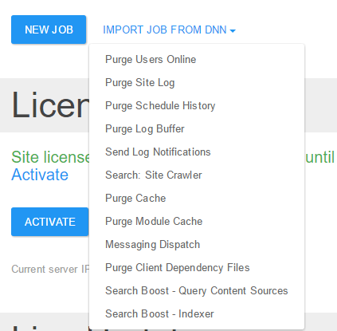

# Migrate from DNN Scheduler

Notice the Portal and User context options. Right now, Sharp Scheduler is a Host module - that is the same set of jobs exists for all portals and Super Users manage them. But it's still possible to have a job execute under a portal using the Context Portal setting. That gives a meaning to the [Portal:xxx] tokens as well as file paths, page listings, user listings and so on, i.e. everything that comes under a portal.

Additionally, it's possible to also specify an user. If the Context Portal is also set, then the user must exist on the selected portal. Having specified an user, Sharp Scheduler will give meaning to User tokens as well as restrict access to resources based on that user permissions.

Add a DNN job manually 

In the Jobs administrative page, choose "New job" and in the job details page add a new action "Integration \ Run DNN Job". After that, you can select the desired job from the drop-down found in the "DNN Job" section. You should also add a trigger for the job to have it scheduled at some specific time.  In summary, this way of adding a DNN job is similar to the previous one except that you must also add a trigger and the equivalent DNN job remains enabled in the DNN scheduler. But it is very useful if you wish to add your own DNN actions to existing jobs (being aware that if an action fails, the subsequent ones will not be executed).