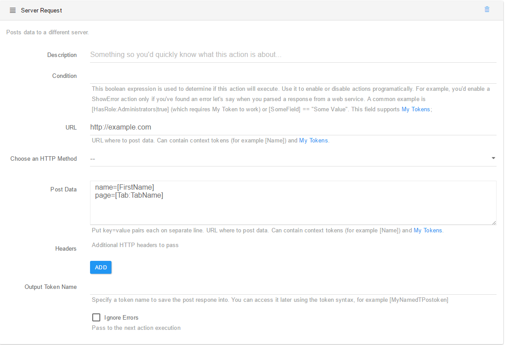

# Post Data

This action can be used to make an HTTP request to a different server, optionally sending data. Often, this means invoking a web service. Note that if you don’t run in Full Trust, this action requires that the Application Pool identity has Web Permission. The following fields can be configured: 

URL. This represents the URL to make the request to. A common mistake is to forget to include the protocol. For example www.domain.com/webservice is wrong. Instead, use http://www.domain.com/websservice. Optionally, append the query string directly to the URL after the question mark. For example http://www.domain.com/websservice?q=test&p=1. This field supports context tokens and My Tokens.

POST Data. This is data to send to the URL using POST operation. Put key=value pairs, each on a separate line. It’s also possible to post whole messages, for example and XML (that SOAP-like services expect) by simply putting the XML without any lines. This field supports context tokens and My Tokens.

