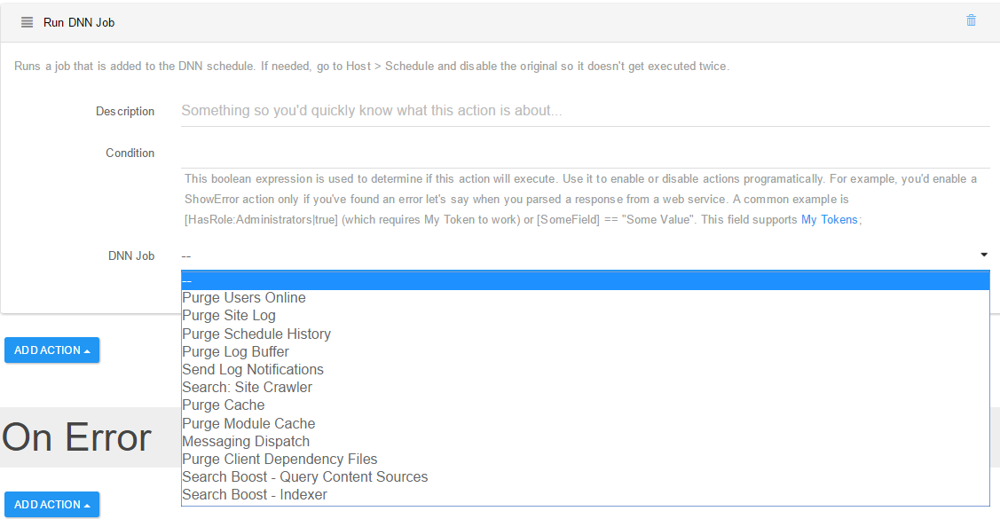

# Run DNN Job

This action is used to execute a job from the DNN Scheduler. These jobs implement a special interface from DNN and they can only be created programatically. That’s one of the biggest pains that Sharp Scheduler alleviates by allowing new jobs to be created at runtime from the administration console. 

Importing from DNN has the same effect as creating a new job, adding a new Run DNN Job action for the respective job, copying the time interval and stopping the job from DNN Scheduler to prevent it from running twice. Note that if you add this action manually (without using the DNN import button), you’ll need to stop the job from DNN Scheduler yourself. 

There are some immediate advantages when migrating the jobs from DNN scheduler to Sharp Scheduler: 

**Write more complex schedules**. The standard DNN Scheduler is limited to run a job on a time interval

**Group it in multiple jobs**. In Sharp Scheduler you can attach a DNN job to any number of jobs. This is possible because the DNN Job is an action just like any other, therefore all the rules apply – the order in which they are executed, the execution is stopped if any action fails and so on.

**Better logging and history viewer**. Sharp Scheduler logs detailed information about jobs and the context in which they run. Also, there is a History viewer that is easily browsable and can be further filtered to see jobs by their success status.

