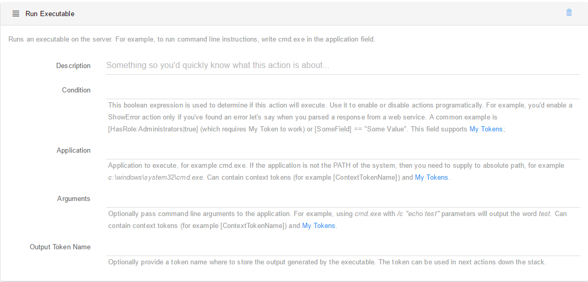

# Run Executable

This action runs an executable on the server, optionally capturing the output. This makes it a powerful integration point with the system or custom binaries. Note that if you don’t run in Full Trust, this action requires that the Application Pool identity to have appropriate permissions. The following configuration options are exposed: 

Application. Determines which application to execute, for example cmd.exe. If the application is not the PATH of the system, then you need to supply to absolute path, for example c:\windows\system32\cmd.exe. This field supports context tokens and My Tokens.
Arguments. Optionally pass command line arguments to the application. For example, using cmd.exe in the Applicationfield and /c "echo test" in this field will output the word test. Can contain context tokens (for example [ContextTokenName]) and My Tokens.
Output Token Name. Optionally, provide a name under which to store the execution result in the job context. This will make it possible to use in other actions down the stack. Note how the examples provided here use instructions from the standard windows command line. But this is very limiting, that’s why we also implemented another action that provides access to the Windows Power Shell.

